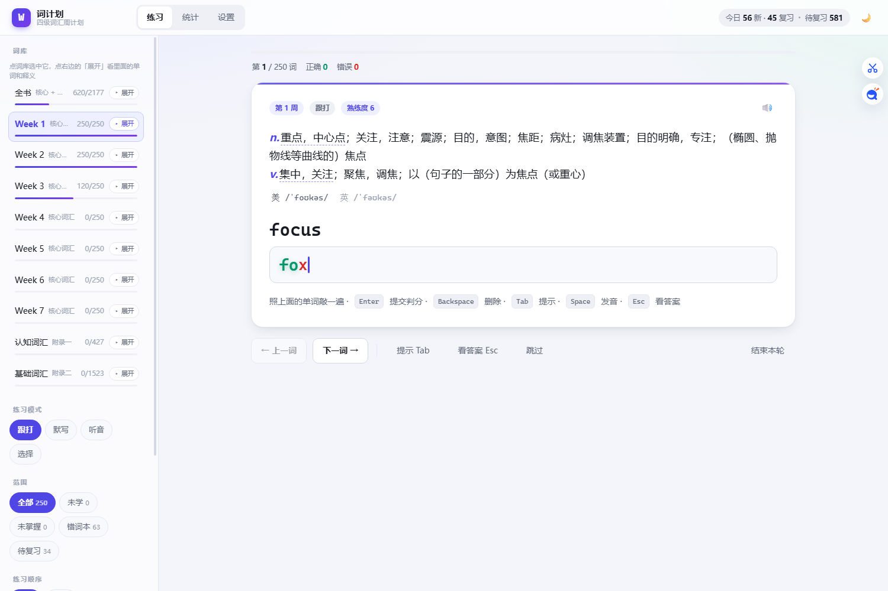
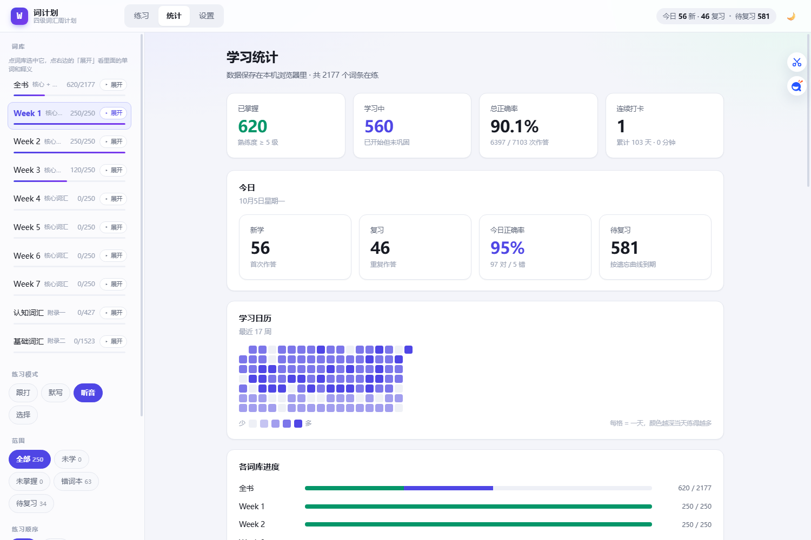
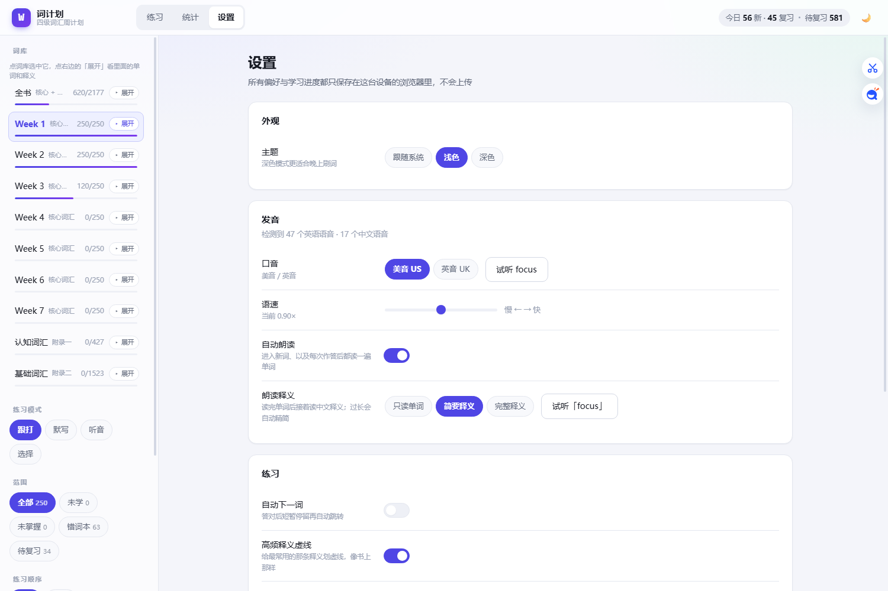
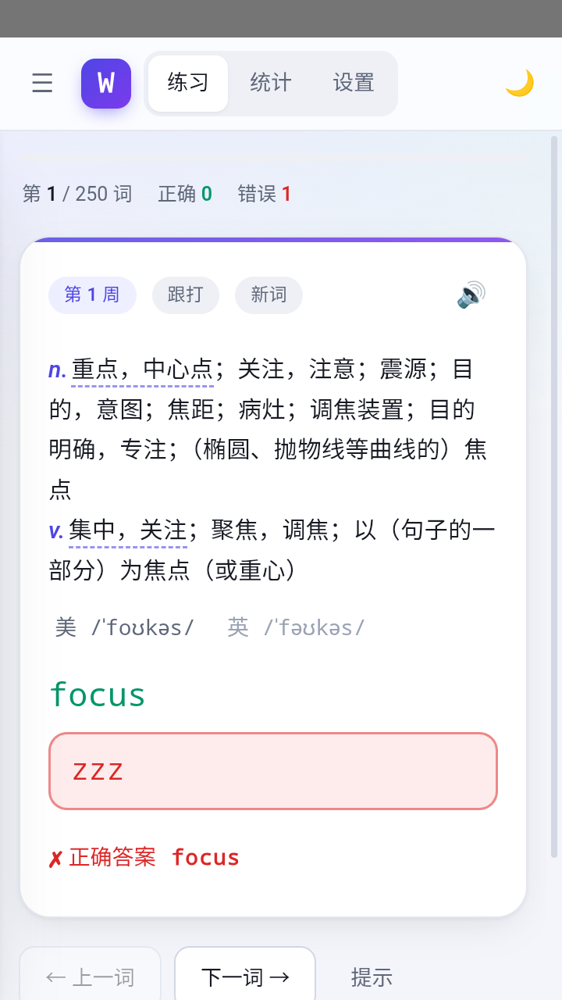

# 词计划 · 四级词汇周计划

把星火《四级词汇周计划》的词汇做成了**能直接导入背单词软件的词表**，并配了一个**自己用的背单词应用**。

> 词表里的**单词和顺序与书上完全一致**（来源见下文「数据从哪来」），不是网上随便找的四级大纲词库。

```
.
├─ cet4-sparke/     词表工程：从官方资源包抽出词序 → 补音标释义 → 导出各种格式
└─ cet4-trainer/    背单词应用：零依赖的网页版 + Windows 版 + 安卓版
```

---

## 一、词表（`cet4-sparke/`）

《四级词汇周计划》山东星火国际传媒集团 · ISBN 978-7-231-02372-5。
书上正文核心词汇**分 7 周、每周 250 词**（按历年真题出现频次由高到低排列），后面还有附录。

| 部分 | 词数 | 产出文件 |
|---|---|---|
| Week 1–7 核心词汇 | 1750 | `output/cet4_zhoujihua_week1..7.json` |
| 认知词汇（附录一） | 427 | `output/cet4_zhoujihua_cognitive.json` |
| 全书（核心 + 认知） | **2177** | `output/cet4_zhoujihua_full.json` |
| 基础词汇（附录二，与上面零重合） | 1523 | `output/cet4_zhoujihua_basic.json` |

每种还导出了 CSV（带 BOM，Excel 直接打开）、Anki 导入用的 TSV、纯单词表：

```
cet4-sparke/output/
  cet4_zhoujihua_full.json          581 KB   全书，Qwerty Learner 词典格式
  cet4_zhoujihua_full_brief.json    407 KB   同上，释义精简版
  cet4_zhoujihua_week1..7.json      各 250 词
  cet4_zhoujihua_cognitive.json     附录一 · 认知词汇 427 词
  cet4_zhoujihua_basic.json         附录二 · 基础词汇 1523 词
  cet4_zhoujihua.csv                679 KB   全书 CSV（word,translation,usphone,ukphone,week）
  cet4_zhoujihua_basic.csv          122 KB
  cet4_zhoujihua_anki.txt           204 KB   制表符分隔，Anki「按 Tab 分隔」导入
  cet4_zhoujihua_basic_anki.txt      53 KB
  cet4_zhoujihua_wordlist.txt        29 KB   每行一个单词
```

### 导入到别的软件

- **Anki**：新建笔记类型 → 字段用 `单词` / `释义` → 导入 `cet4_zhoujihua_anki.txt`，分隔符选 **Tab**。
- **Qwerty Learner**（qwertylearner.cn 那个开源项目）：把 `cet4_zhoujihua_full.json` 放到你部署的 `public/dicts/` 下，
  再到 `src/resources/dictionary.ts` 的 `chinaExam` 数组里注册一条（`id` / `name` / `url: '/dicts/xxx.json'` / `length: 2177` …）。
  网页版本身没有「上传自定义词典」的入口，得自己部署一份。
- **通用**：`cet4_zhoujihua.csv` 或 `cet4_zhoujihua_wordlist.txt`。

### 数据从哪来

- **单词与顺序**：星火官方配套资源包里的 `.lrc`（歌词文件只含单词和时间轴，如 `[00:02.56]focus`）。
  资源包 `DCZB251` 与 `DCZB231` 两版音频的 MD5 一致，取一版即可。`sparke_pack/lrc_utf8/*.lrc` 就是这 11 个文件。
- **音标与释义**：有道词典的在线接口（`dict.youdao.com/jsonapi`），结果缓存在 `dict/`。
  附录二「基础词汇」用的是书上原本的释义写法。
- **「高频释义虚线」用的频次**：有道「权威英汉双解」里的 Collins COBUILD 语料库义项排序，
  也就是应用里那条虚线的依据（见下）。
- **没有的东西**：书上纸质排版里的**高频释义标注**，官方资源包里根本没有，
  所以只能用 Collins 语料频次做**可解释的近似**，而不是还原。

### 重新生成

```bash
cd cet4-sparke
node tools/build_book.mjs      # 读 sparke_pack/ + dict/ → 写 output/
node tools/verify.mjs          # 23 项校验：词序/拼写/文件格式/各分卷词数
```

---

## 二、背单词应用（`cet4-trainer/`）

零依赖静态前端（原生 ES Module + 手写 CSS，**不需要 npm install、不需要打包**）。



- **四种模式**：跟打（逐键判定，敲对变绿放大带光晕）· 默写（字母遮罩）· 听音（只放音）· 选择（四选一）
- **范围筛选**：全部 / 未学 / 未掌握 / 错词本 / 待复习；顺序支持书序与打乱；每轮数量随便填，留空就是整本一次背完
- **间隔重复**：熟练度 0–7 级，间隔 `[0,1,2,4,7,15,30,60]` 天；答对升一级，答错降两级并 10 分钟后重来；≥5 级算掌握
- **进度续传**：按词为单位记进度，所以「全书」和「按周」两个词库共享同一份进度；续传时上次背过的词仍在会话里，「上一词」能翻回去
- **答错一定停下来**：设置里的「答对后自动下一词」只对答对的词生效
- **可选写法都算对**：书上写 `program(me)`、`realize,-ise`，打 `program` / `programme` / `realise` 都判对
- **高频释义虚线**：按 Collins 语料库的义项频次给最常用的那条释义划虚线（可在设置里关）
- **点音标就发音**：点「美」发美音、点「英」发英音（走浏览器自带的语音合成）
- **统计**：已掌握 / 学习中 / 总正确率 / 连续打卡、今日四格、17 周热力图、各词库进度、错词榜
- **点词库能展开**看里面的单词和释义头一小截（已掌握的标绿），限高 `min(46vh, 400px)` 内部滚动

| 统计 | 设置 | 手机端 |
|---|---|---|
|  |  |  |

### 三种用法

成品在 **[Releases](https://github.com/EnzoVechace/CET-4-for-word/releases/latest)** 里下载（不放在 git 历史里，免得每次重新打包都往仓库塞几 MB 二进制）：

| 用法 | Release 里的文件名 | 说明 |
|---|---|---|
| Windows | `WordPlan-1.1-win64.exe` | 3.6 MB，内嵌 WebView2 引导安装器；目标机器没装运行时会弹窗问你要不要装 |
| Android | `WordPlan-1.1-android.apk` | 370 KB，内置一个本地静态服务器（固定端口 `127.0.0.1:17653`） |
| 网页版 | `WordPlan-1.1-web.html` | **双击就能用**（单文件，词库内嵌）。手机上也能开 |
| 说明 | `WordPlan-1.1-readme-zh.txt` | 上面几个的简版说明 |

> Release 附件名只能是 ASCII —— GitHub 会把非 ASCII 字符直接从文件名里删掉
> （`词计划.exe` 会变成 `default.exe`），所以上传用的是英文名。中文说明写在
> release 正文里。

**Windows 第一次运行会被 SmartScreen 拦一下**（「Windows 已保护你的电脑 / 阻止了无法识别的应用启动」）。这是正常的，不是报毒：exe 没有代码签名证书，下载量也还少，SmartScreen 攒不出「知名度」。继续运行二选一：

- 弹窗里点左下角带下划线的「**更多信息**」→ 下面会多出「**仍要运行**」按钮，点它；
- 或者先在文件上右键 →「属性」→ 勾「**解除锁定**」→「确定」，再双击就不弹了。等价命令：`Get-ChildItem -Filter "WordPlan*.exe" | Unblock-File`

只有第一次需要这么点一下。要彻底消除这个提示，只能买 Authenticode 代码签名证书（OV 约 $200/年，EV 才有即时的 SmartScreen 信誉，约 $400/年），个人免费项目一般不做。

想自己从源码构建，见下面「打包与测试」。

本地起服务来开发：

```bash
cd cet4-trainer
node server.mjs 5199          # 想给手机局域网访问就加 --lan
```

### 目录

```
cet4-trainer/
  server.mjs          零依赖静态服务器
  public/             前端（也是 exe / apk 里嵌的那份）
    js/               app / dict / practice / stats / settings / store / speech / ui
    css/style.css     全套设计系统（浅色 + 深色）
    dict/             10 个词库（week1..7、cognitive、basic，full 是虚拟组合）
  native/Program.cs   Windows 宿主（WinForms + WebView2，C# 5 语法，csc.exe 直接编译）
  android/            安卓宿主（AssetServer 提供本地 http，TTS 与深色模式桥）
  tools/              构建与测试脚本，产物写到 dist/（该目录不进 git，见 .gitignore）
```

### 打包与测试

```bash
cd cet4-trainer
node tools/get_webview2.mjs        # 需要时：下载 WebView2 SDK
node tools/get_bootstrapper.mjs    # 需要时：下载 WebView2 引导安装器
node tools/android_sdk.mjs         # 需要时：下载 Android SDK 命令行工具
node tools/build_dict.mjs          # 从 cet4-sparke/output 编译词库
node tools/make_single.mjs         # → dist/词计划.html
node tools/build_win.mjs           # → dist/词计划.exe
node tools/build_apk.mjs           # → dist/词计划_1.1.apk
node tools/e2e.mjs                 # 桌面端 41 项断言（CDP 驱动无头 Edge）
node tools/e2e_mobile.mjs          # 触摸端 15 项断言
```

`tools/e2e.mjs` 走 Chrome DevTools Protocol，需要先按 README 里的说明起一个带 `--remote-debugging-port` 的 Edge。

### 发布新版本

三端成品不进 git（`dist/` 已被 `.gitignore` 忽略），改挂到 Releases：

```bash
git tag -a v1.2 -m "词计划 1.2" && git push origin v1.2

cd cet4-trainer
$env:GH_TOKEN = "ghp_xxx"      # https://github.com/settings/tokens，勾 repo
node tools/release.mjs v1.2    # 建 release + 传 dist/ 里的成品；可反复跑，同名 asset 会先删再传

# 只传其中几个
$env:ASSETS = "WordPlan-1.2-win64.exe,WordPlan-1.2-readme-zh.txt"
# 清掉改名/换版本后残留的旧 asset
$env:PRUNE = "1"
```

两个坑：

1. **附件名只能是 ASCII**。GitHub 会把非 ASCII 字符直接从名字里删掉：`词计划.exe` → `default.exe`、`wordplan-说明.txt` → `wordplan-.txt`。所以 `release.mjs` 里用英文名（`WordPlan-<版本>-win64.exe` / `-android.apk` / `-web.html` / `-readme-zh.txt`），中文说明写在 release 正文里。脚本发现名字被改会直接报错退出。
2. **本机 hosts 把 github.com 全指到了 `127.0.0.1`**，普通 `fetch` 一律 `ECONNRESET`。`release.mjs` 因此自己向公共 DNS（默认 `114.114.114.114`，可用 `DNS_SERVERS` 改）问真实 IP，再用「连 IP + SNI/Host 仍写域名」的方式请求。

---

## 三、版权说明

- 本仓库**不包含**星火官方资源包里的音频（`sparke_pack/ex*`）和压缩包，那部分是版权材料，而且体积巨大。
  只保留了从中提取出来的 **11 个 `.lrc` 词序文件**（纯文本，仅含单词与时间轴）。
- 音标与释义来自有道词典的公开接口，版权归原词典方所有；词表仅供**个人学习**使用，请勿商用或二次分发。
- 书里的**高频释义标注**属于原书编排，本仓库用的是 Collins 语料库频次的近似替代，不是原书标注的复制。
- 签名密钥（`android/keystore/`）**没有入库**，请自行用 `keytool` 生成一份再打包。
